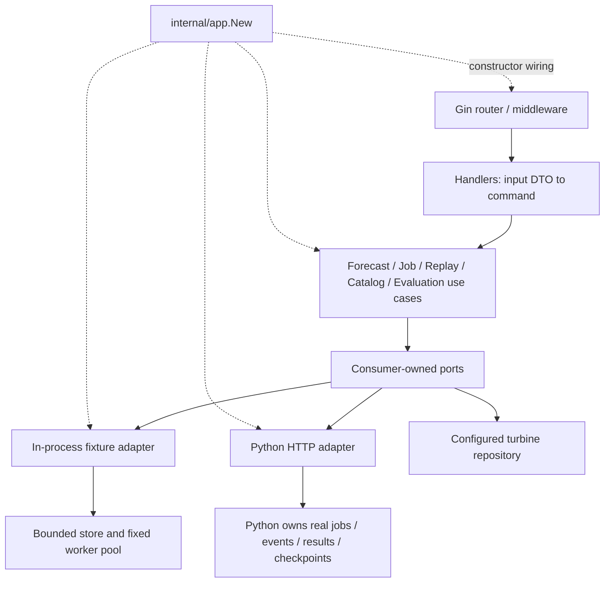

# Architecture

`domain` is infrastructure-independent and carries no JSON/HTTP/env knowledge. It defines identity, time, coverage, provenance and quantile invariants, errors, requests, results and read models. `application/ports` defines small interfaces for the owning consumer. Services apply policy, canonicalization and capability checks; replay export asks for a terminal child snapshot and fetches already validated results.

Handlers own decoding, defaults, request schema checks, query parsing, status mapping and JSON/CSV/SSE formatting. A handler holds incoming usecase interfaces only. Schema validation is a transport concern. It never owns a repository, gateway, Python client or job transition. SSE timers implement delivery polling; all reads still pass through JobService.

`agenthttp` has its own generated upstream DTOs. The public and internal protocols currently share field schemas, but neither protocol's JSON tags enter domain. All mappings are explicit generated Go functions. There is no reflection-driven DI or global service locator. A request context contains cancellation and request ID metadata only, never dependencies.

`app.New` creates each resource once per application. A second App gets independent settings, stores, clients and shutdown context. Mock shared state is mutex-protected; returned slices/pointers are copied. Configured turbine metadata is copied on reads. No package-level mutable state or application singleton is used. Instance `sync.Once` only makes shutdown repeatable.

The mock enforces job state transitions under the same mutex used to publish results. Cancellation and completion have one winner. Replay parents derive counters from child states: all completed → completed; any failures after all children terminate → failed; cancellation request/child cancellation → cancelled. Successful child results survive failed or cancelled parents.

Worker count, pending queue, retained jobs, retained events and simultaneous SSE connections are bounded. Workers never block on subscribers. SSE reads bounded event pages and applies write deadlines. The terminal status is read before draining the final log tail, avoiding missed completion events. Request disconnect closes polling only.

Shutdown cancels local stream contexts and simulator workers, closes idle outbound connections and drains the HTTP server. It sends no cancellation to Python. Mock is disposable and loses state on restart. Python production deployment needs a persistent transactionally idempotent job registry, durable queue acceptance, append-only monotonic events, immutable results/manifests, cancellation flags and restartable checkpoints. Those responsibilities are intentionally not duplicated in Go.

Architecture tests parse imports to enforce the direction of dependencies. Usecase tests use fake ports; handler tests use a fake usecase; adapter tests use local `httptest.Server`; integration tests start separate full Apps.
