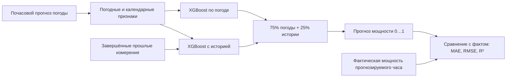

# HackAlem AI — прогноз мощности ВЭС

Все команды в этом документе выполняются из каталога `ml`:
из корня репозитория сначала выполните `cd ml`. Результаты сохраняются в `ml/outputs`.

Обученные модели XGBoost прогнозируют почасовую нормализованную мощность двух
турбин на 24–48 часов по архивным прогнозам GFS и доступным прошлым замерам. Реализованы подготовка SCADA,
загрузка погоды, обучение, проверка на январе 2026 и ежедневное воспроизведение
прогнозов на февраль 2026. Все результаты сохраняются локально.

**Попытка достичь 80% попаданий в ±10 п.п.:** проверены 14 вариантов с GFS,
ICON, совместной погодой и прошлой историей турбин. Выбранная по CV модель даёт
**56,6% на январе вместо 32,1%**, а на четырёх месяцах CV — **62,7%**.
**80% не достигнуто.** На январе MAE при этом ухудшилась с 23,5 до **25,7 п.п.**,
RMSE — с 31,0 до **37,2 п.п.** Даже постоянный прогноз 0,10 даёт 52,1% попаданий:
рост этой метрики не означает улучшение всех аспектов прогноза.
Поэтому новый вариант сохранён отдельно; запуск по умолчанию использует прежнюю модель.
[Подробный отчёт и протокол](reports/accuracy/report.md), [метрики](reports/accuracy/metrics.json).

Проверить новый вариант в интерфейсе, из каталога `ml`:

```powershell
.\.venv\Scripts\python.exe -m wind_forecast.ui --artifact-dir artifacts/accuracy --port 8766
```

Открыть **http://127.0.0.1:8766**. Карточка «Попадания в ±10 п.п.» показывает
долю выбранных часов, для которых ошибка не превышает 0,10 исходной шкалы мощности.
Новые модели и прогнозы: `artifacts/accuracy/`; повторение эксперимента:
`python scripts/improve_accuracy.py`. Архив ICON предварительно загружается командой из отчёта.
После изменения кода эксперимента используйте `--fresh`, чтобы повторно обучить все варианты.
Январь уже изучался ранее и не является новым независимым тестом.
Для нового варианта архив погоды — `data/weather/ensemble/archive.csv`; интерфейс
выбирает его по метаданным модели. В ручном сценарии и погодном CSV доступен только
один набор погодных полей: дополнительные поля ICON остаются неизвестными (NaN).
Качество 56,6% относится к полной архивной погоде и не переносится автоматически на такой ввод.

**Предыдущий эксперимент по MAE:** средняя MAE на четырёх месяцах валидации **0,2097** против
**0,2286** у прежних параметров — улучшение **8,3%**. Выбрана комбинация 75%
погодной модели и 25% модели с историей; без свежих замеров используется только погода.

| Повторная проверка на январе 2026 | Первая версия | Новая комбинация |
|---|---:|---:|
| MAE | 0,2488 | 0,2350 |
| RMSE | 0,3096 | 0,3101 |
| R² | 0,1584 | 0,1556 |

На январе MAE улучшилась на **5,5%**, RMSE слегка выросла. Ошибка пока существенная.
MAE измеряется в долях шкалы нормализованной мощности, а не в «процентах точности».
Январь уже просмотрен в первой версии и не является новым независимым тестом.
Параметры и вес комбинации выбраны без использования январских целей.
Новые [сравнение](reports/improved/comparison.md) и [метрики](reports/improved/metrics.json);
сохранённые [отчёт первой версии](reports/model_report.md) и [метрики первой версии](reports/metrics.json).

**Проверка на открытых данных:** готовая модель без дообучения проверена на одной
турбине Kelmarsh, Великобритания: MAE **0,1494**, RMSE **0,1897**, R² **0,5306**.
Использованы реальные измерения мощности из [Zenodo / Cubico](https://zenodo.org/records/16807551)
и архив прогнозов GFS за 2024 год: 15 222 прогноза для 7 623 уникальных часов,
86,65% от запланированной годовой проверки; остальные строки не имеют полной погоды или факта.
На одинаковых часах MAE ниже переноса последней мощности на **28,4%**.
Это проверка переноса на другую станцию: веса обучены до января 2026, поэтому
результат не является историческим прогнозом «как в 2024» и не заменяет точность
на наших турбинах. [Полный протокол и результаты](reports/public_validation/report.md).

Повторить проверку из скачанных файлов, без сети и обучения:

```powershell
.\.venv\Scripts\python.exe scripts/public_kelmarsh.py --stage evaluate
```

Первый запуск со скачиванием открытых данных: та же команда без `--stage evaluate`.
Нужна готовая `artifacts/improved/model.joblib`.

## Как получается прогноз

**Результат — средняя нормализованная активная мощность каждой турбины за час**,
в шкале 0…1 исходного датасета. В интерфейсе 0,55 отображается как 55% этой шкалы.
Номинальные мощности и точная формула исходной нормализации пока не подтверждены,
поэтому вывод в МВт/МВт·ч для турбин кейса не включён. Если подтвердится, что
нормализация — деление на номинал, то `P_МВт = p × P_ном`, а энергия за час равна
`P_МВт × 1 ч`; для суток энергии часов суммируются.



1. Из CSV турбины берутся 10-минутные измерения. Шесть корректных записей дают
   среднюю мощность за полный час; неполный час исключается из оценки.
2. К каждому часу присоединяются прогнозы ветра на 10/100 м, направления ветра,
   температуры и давления. Добавляются час суток, сезон, разница ветра по высоте,
   компоненты направления и приближённые признаки плотности воздуха и `ρ × v³`.
   Последний — вспомогательный признак; сам прогноз строится обученными деревьями.
3. Если доступны свежие прошлые измерения, вторая модель также получает последнюю
   мощность, ветер, температуру, их лаги, средние и разброс. Час 22:00–23:00
   становится доступен в 23:00; данные прогнозируемого будущего часа не подаются.
4. Две модели XGBoost обучаются с учителем на парах «входы → фактическая мощность».
   Глубина, число деревьев и вес комбинации выбраны по последовательным временным
   проверкам. Текущая комбинация: `p = 0,75 × p_погода + 0,25 × p_история`.
   Например, 0,60 и 0,40 дают 0,55. Если история отключена или устарела, используется
   только погодная модель. Оба прогноза перед смешиванием ограничиваются шкалой 0…1.

Погода загружается из [Open-Meteo Previous Runs API](https://open-meteo.com/en/docs/previous-runs-api),
модель **NOAA GFS**, параметр `models=gfs_global`, по координатам из `config.json`:
`43.645150, 78.535604` и `43.643198, 78.538828`. Это прогноз метеомодели для места
станции; измерения ветра из SCADA отдельно используются как прошлая история.
Для горизонта мощности 1–24 ч берём погодные значения `previous_day2`,
для 25–48 ч — `previous_day3`: прогнозы с упреждением 48/72 ч относительно
целевого часа. Проверяется доступность с дополнительным запасом 6 ч.
API не даёт точных идентификаторов этих выпусков, поэтому это консервативное
приближение доступности. Загруженные ответы с URL и временем получения находятся
в `data/weather/cache/`, объединённая таблица — `data/weather/archive.csv`.

| Режим интерфейса | Погода | Фактическая мощность |
|---|---|---|
| Проверка января / прогноз февраля | Локальный архив прогнозов GFS | Локальный SCADA, если есть |
| Загрузка исходного CSV турбины | Локальный архив прогнозов GFS | Загруженный CSV |
| Загрузка CSV погоды | Погодные столбцы загруженного CSV | Необязательный `actual_power` |
| Своя погода | Введённые вручную значения на весь горизонт | Не используется |

При открытии интерфейса свежая погода из интернета автоматически не запрашивается.
Интерфейс не переобучает модель: загруженные правильные ответы нужны для оценки,
а обновление обучения запускается командой `python -m wind_forecast improve`
после подготовки данных. Первоначальное обучение использовало ваши турбины;
открытый Kelmarsh использован только для отдельной проверки переноса.

**Ошибка считается после прогноза:** `MAE = mean(abs(прогноз − факт))`,
`RMSE = sqrt(mean((прогноз − факт)²))`. Например, прогноз 0,55 и факт 0,50 дают
ошибку 0,05, или 5 процентных пунктов шкалы мощности. R² сравнивает квадратичную
ошибку с постоянным средним факта на том же периоде: 1 — идеальное совпадение,
0 — уровень этого среднего, отрицательное значение — хуже него. Метрики на странице
относятся только к выбранным часам с фактом, поэтому могут отличаться от отчёта за месяц.
При отсутствии факта метрики не рассчитываются; для одного часа R² не определяется.
Полоса 80% строится по 10-му и 90-му процентилям декабрьских ошибок, отдельно по
турбине и дню прогноза; это эмпирический ориентир, не гарантия покрытия.

## Локальный интерфейс

Из каталога `ml` запустите:

```powershell
.\.venv\Scripts\python.exe -m wind_forecast.ui
```

Откройте **http://127.0.0.1:8765**. Сервер работает только на этом компьютере;
для остановки в терминале нажмите `Ctrl+C`. Другой порт: `--port 8766`.
Нужны подготовленные локальные данные и модели из `artifacts/improved/`.
Дополнительные библиотеки для интерфейса не требуются.

Доступны четыре режима:

- **Загрузить CSV** — выберите файл погоды или исходный CSV одной турбины.
  Формат определяется автоматически; затем выберите дату, турбину и горизонт.
- **Проверка на январе** — выберите дату, турбину и горизонт 24/48 ч. Модель до
  декабря 2025 сравнивается с фактом января; можно отключить прошлые измерения.
- **Прогноз на февраль** — производственная модель и архив погоды февраля 2026.
  Фактических ответов нет, поэтому точность не выводится.
- **Своя погода** — задайте ветер на 10/100 м, направление, температуру и давление.
  Это сценарий с постоянной погодой на всём горизонте, без истории и оценки точности.

На странице есть график, таблица по часам и скачивание CSV. MAE/RMSE показаны в
процентных пунктах нормализованной мощности, R² — в обычной шкале. Метрики относятся
только к выбранным часам; при выборе 31 января на 48 ч факта для февраля не будет.
Интерфейс использует готовые модели и локальные архивы, без обучения и запросов к сети.

### Входные CSV

В режиме **Загрузить CSV** доступна кнопка **Скачать шаблон погоды**. Примерные
значения в шаблоне вымышлены. Обязательные столбцы почасовой погоды:

```csv
valid_time,wind_speed_10m,wind_speed_100m,wind_direction_100m,temperature_2m,surface_pressure,actual_power
2026-02-01 00:00,5,8,270,5,930,
2026-02-01 01:00,5.5,8.5,280,4,930,
```

`valid_time` — начало часа: время без смещения читается как **Asia/Almaty**;
также поддерживается ISO с `Z` или явным смещением. Ветер — **м/с**, направление —
**градусы**, температура — **°C**, давление у поверхности — **гПа**.
Необязательный `actual_power` — фактическая нормализованная мощность **0…1**,
используемая только для оценки ошибки; неизвестные значения оставьте пустыми.
Необязательный `turbine_id` задаёт 1/2; без него используется турбина из формы.
Необязательный `issued_at` содержит почасовую метку выпуска погоды; проверяется,
что она не позже момента выпуска прогноза мощности. Происхождение погоды из
пользовательского файла не подтверждено, поэтому интервалы из калибровки GFS скрыты.

С первой записи выбранной даты обрабатывается до 24/48 последовательных часов.
Если файл короче, рассчитываются имеющиеся часы; дубли и пропуски внутри периода
вызывают ошибку. Для готовых моделей доступны даты с января 2026; январь проверяется
моделью до декабря, более поздние периоды — производственной моделью.

**Исходные CSV турбин из кейса можно загружать без изменения заголовков.** Выберите
один файл и соответствующую турбину. Также распознаются английские столбцы
`timestamp,power,wind_speed,temperature` с 10-минутными местными метками времени.
Из файла берутся факт и только доступная к моменту выпуска история. Погода — из
локального архива GFS; проверка в этом режиме ограничена январём–февралём 2026.
На каждый полный час нужны шесть корректных измерений, пропуски не заполняются.

Поддерживаются UTF-8 (включая BOM), Windows-1251, разделители `,`, `;` и табуляция,
а также десятичная запятая при корректном CSV-разделении. Лимит — **16 МиБ**
и **250 000 строк**. Загрузка не изменяет исходные файлы, модель и локальные архивы.
После перезапуска сервера файл нужно выбрать заново; в памяти хранятся три последние загрузки.

## Обучение с учителем и новые эксперименты

В этой задаче **X** — погода (и доступные прошлые замеры), **y** — фактическая
почасовая мощность. Во время обучения модель получает примеры `(X, y)`, делает
предсказания и строит новые деревья, корректирующие ошибку. При проверке модель
получает только входы; правильные ответы используются для подсчёта ошибки.
Если после такой проверки учить модель на этих ответах, нужен следующий,
ещё не использованный период для независимой оценки.

Делить именно пополам необязательно. В новых экспериментах первая проверка
использует историю до января 2025 — примерно первую половину доступной погодной
истории. Дальше объём обучения растёт. По умолчанию проверяются январь, май,
сентябрь и ноябрь 2025. Для каждого месяца модель заново обучается только на
более ранних данных. Параметры выбираются по средней MAE этих четырёх блоков.
Январь 2026, который уже просмотрен в первой версии, служит повторной проверкой,
а не новым слепым тестом.

Полный подбор на подготовленных данных, одной строкой в PowerShell:

```powershell
.\.venv\Scripts\python.exe -m wind_forecast improve
```

Команда сравнивает по 10 наборов параметров для двух вариантов входов: только
погода и погода с историей. Подбираются глубина, минимальный вес листа,
регуляризация и функция ошибки (`reg:squarederror` / `reg:absoluteerror`).
Число деревьев определяется ранней остановкой на отдельном прошлом блоке
внутри обучения; проверяемый месяц не используется для ранней остановки.
Целевая метрика выбора — **MAE**; RMSE и R² также сохраняются, поскольку
улучшение MAE не обязательно улучшает большие ошибки.
После подбора проверяется усреднение двух моделей с весом истории
0/25/50/75/100%; вес также выбирается только по четырём месяцам валидации.
Для финального обучения число деревьев берётся как медиана лучших итераций
ранней остановки по этим месяцам.

История содержит последние завершённые измерения мощности, ветра и температуры,
лаги 3/6/24 часа, средние 3/6/24/72 часа и разброс за сутки. Снимок истории
строится на момент выпуска, а не на прогнозируемый час. Будущие измерения
игнорируются. Если последний полный час старше 3 часов либо в суточном окне,
заканчивающемся этим часом, есть менее 12 полных часов, используется погодная модель. Эти пороги находятся
в `config.json` → `history`.

Результаты сохраняются отдельно от первой версии:

- `reports/improved/comparison.md` — сравнение вариантов;
- `reports/improved/metrics.json` — параметры, метрики каждого месяца и повторной проверки;
- `reports/improved/learning_curve.png` — как ошибка меняется по мере обучения;
- `artifacts/improved/model.joblib` — комбинация, выбранная по временной валидации;
- `artifacts/improved/weather_model.joblib` — принудительный погодный режим;
- `artifacts/improved/history_model.joblib` — вариант с историей и погодным резервом;
- `artifacts/improved/evaluation_model.joblib` — модель до периода повторной проверки;
- `artifacts/improved/cv_predictions.csv` и `regression_predictions.csv` — ответы и ошибки.

Прогноз февраля с новой моделью и имеющейся историей:

```powershell
.\.venv\Scripts\python.exe -m wind_forecast replay --model artifacts/improved/model.joblib --hourly data/processed/hourly.csv --output-dir outputs/improved/february
```

В феврале после первого выпуска SCADA из предоставленных CSV устаревает.
Поэтому большинство февральских выпусков используют только погоду: программа
не подставляет неизвестную фактическую мощность или собственные прогнозы вместо
наблюдений. Столбец `prediction_mode` показывает, какой режим сработал.
Без `--hourly` модель также использует только погоду.

Для других периодов доступны `--fold-starts`, `--calibration-start`,
`--test-start`, `--test-end` (исключительная правая граница). Все проверочные
месяцы должны заканчиваться до калибровки; калибровка — до финальной проверки.
Для короткой проверки самого процесса можно указать `--trials 1`.

## Сравнение сохранённого прогноза с реальными ответами

Проверить новую модель на уже имеющихся январских измерениях:

```powershell
.\.venv\Scripts\python.exe -m wind_forecast evaluate --predictions artifacts/improved/regression_predictions.csv --hourly data/processed/hourly.csv --output-dir outputs/improved/evaluation
```

Когда появятся фактические CSV за февраль, сначала подготовьте их командой
`prepare`, задав отдельный `--output-dir data/processed/february`, затем:

```powershell
.\.venv\Scripts\python.exe -m wind_forecast evaluate --predictions outputs/improved/february/submission.csv --hourly data/processed/february/hourly.csv --output-dir outputs/improved/february_evaluation
```

`evaluate` не обучает модель и не меняет прогнозы. Она сохраняет
`predictions_vs_actual.csv`, MAE/RMSE/R², ошибку по турбинам и горизонтам,
долю найденных фактических ответов. При неполных данных метрика относится
только к совпавшим полным часам; это видно в `target_coverage`.

Проверки кода без записи служебного кэша pytest:

```powershell
.\.venv\Scripts\python.exe -m pytest -q -p no:cacheprovider
```

## Готовые локальные файлы

| Файл | Содержимое |
|---|---|
| `artifacts/model.joblib` | Финальная модель, схема признаков, конфигурация и интервалы |
| `artifacts/evaluation_model.joblib` | Отдельная модель, на которой проверен январь |
| `artifacts/january_backtest.csv` | Фактическая мощность, прогнозы и базовые модели на январе |
| `outputs/february/submission.csv` | 1 344 строки: 672 часа февраля × 2 турбины, ежедневный прогноз на 1–24 ч |
| `outputs/february/submission_farm.csv` | 672 почасовых средних нормализованных мощности двух турбин |
| `outputs/february/turbines.csv` | Все 28 выпусков по 48 часов × 2 турбины; последний захватывает 1 марта |
| `outputs/february/farm.csv` | Агрегация всех выпусков по двум турбинам |
| `reports/january_backtest.png` | График первой недели проверки |
| `data/processed/data_quality.json` | Пропуски и качество исходных данных |

Исходные данные, погодный кэш, окружение, бинарные модели и прогнозы исключены
из Git через `.gitignore`. Они остаются на этом компьютере. Исходный код,
конфигурация, тесты и отчёты находятся в ветке `dev/flyin_ml`.

## Установка

Python 3.11+; проверено на Python 3.12.9. Команды ниже для PowerShell:

```powershell
python -m venv .venv
.\.venv\Scripts\python.exe -m pip install -e ".[dev]"
.\.venv\Scripts\python.exe -m wind_forecast --help
```

`requirements-tested.txt` фиксирует основные версии фактически использованного
окружения. Для повторения с ними перед установкой проекта выполните:

```powershell
.\.venv\Scripts\python.exe -m pip install -r requirements-tested.txt
```

Для обычной работы ключи API не нужны. Первичная загрузка погоды требует доступа
к интернету; дальнейшее обучение и прогноз по сохранённому архиву работают локально.

## Воспроизведение

Передайте пути к двум предоставленным CSV; файлы не изменяются. Пример с исходными
именами в папке загрузок:

```powershell
.\.venv\Scripts\python.exe -m wind_forecast prepare `
  --turbine-1 "$env:USERPROFILE\Downloads\Dataset HackAlemAI для участников 11.03.2023-28.02.2026 - turbine 1.csv" `
  --turbine-2 "$env:USERPROFILE\Downloads\Dataset HackAlemAI для участников 11.03.2023-28.02.2026 - turbine 2.csv"

.\.venv\Scripts\python.exe -m wind_forecast fetch-weather --start 2024-01-01 --end 2026-03-01
.\.venv\Scripts\python.exe -m wind_forecast train
.\.venv\Scripts\python.exe -m wind_forecast replay --start 2026-02-01 --end 2026-02-28
.\.venv\Scripts\python.exe -m pytest -q
```

Для одного выпуска:

```powershell
.\.venv\Scripts\python.exe -m wind_forecast forecast --issued-at 2026-01-31T23:00 --horizon 48
```

Без смещения `--issued-at` интерпретируется в часовом поясе модели. Можно явно
передать `2026-01-31T23:00:00+05:00`. Момент выпуска должен быть ровным часом.
Время `valid_time` обозначает начало прогнозируемого часового интервала; прогноз
от 31 января 23:00 начинается 1 февраля 00:00. Исторический replay использует
выпуск в 23:00 местного времени каждые сутки.

## Данные и допущения

CSV фактически содержат данные с 11.03.2023 по **31.01.2026**, хотя в именах указан
февраль. У первой турбины 142 360 строк, у второй — 149 499. В обеих таблицах есть
временные пропуски, особенно летом 2024 у первой турбины.

- Пользователь подтвердил часовой пояс CSV: **`Asia/Almaty`**, включая
  историческое изменение смещения. Подтверждение зафиксировано в `config.json`.
- Неоднозначный час при изменении местного времени исключается: по 6 исходных
  строк на турбину. После этого все временные соединения выполняются в UTC.
- Цель — средняя нормализованная активная мощность за час. По умолчанию нужны
  все 6 десятиминутных измерений. Неполные и отсутствующие часы не заполняются,
  пропуски не превращаются в нулевую выработку. Валидных часов: 23 666 и 24 784.
- Дубликаты времени и неверная временная сетка вызывают ошибку. Некорректные
  числовые измерения исключаются и учитываются в отчёте.
- Архив GFS загружается с января 2024. Обучение использует только пересечение
  полных SCADA-целей и доступных погодных прогнозов. Данные SCADA за 2023 год
  подготовлены и проверены, но не участвуют в этой погодной модели.
- Измеренные в CSV ветер и температура не подаются как будущие признаки:
  в момент прогноза они ещё неизвестны. Признаки берутся из архивных прогнозов.
- Номинальная мощность турбин и точная формула нормализации неизвестны.
  По умолчанию результат — шкала 0–1, а `mean_normalized_power` — простое среднее
  двух турбин. Его можно считать нормализованной мощностью ВЭС при равных
  номинальных мощностях. Для MW/MWh необходимо подтвердить нормализацию и
  задать положительные `rated_power_mw` в конфигурации перед обучением.

## Погода и защита от утечки

Координаты получены из Google Maps по ссылкам в задании:

| Турбина | Широта | Долгота |
|---|---:|---:|
| 1 | 43.645150 | 78.535604 |
| 2 | 43.643198 | 78.538828 |

Источник: [Open-Meteo Previous Runs API](https://open-meteo.com/en/docs/previous-runs-api),
модель `gfs_global`. Используются скорость ветра на 10 и 100 м, направление на
100 м, температура на 2 м и давление. Скорости запрашиваются в м/с.
API возвращает архивные прогнозы фиксированной давности. Для горизонта 1–24 ч
используется `_previous_day2` (48 ч до прогнозируемого времени), для 25–48 ч —
`_previous_day3` (72 ч). Это консервативный выбор с запасом доступности.
Последнее допустимое время происхождения прогноза оценивается как
`valid_time - offset`; дополнительно заложено 6 часов на публикацию.
Код требует `available_at_upper_bound <= issued_at`.

Это **оценка верхней границы времени доступности**, а не фактическая отметка
публикации конкретного выпуска: Previous Runs не возвращает исходный run ID.
Для строгого аудита конкретных метеовыпусков потребуется архив с run ID и журналом
публикаций. Реанализ и фактическая будущая погода не подставляются вместо прогнозов.
Оригинальные ответы API и URL кэшируются с отметкой времени загрузки.
Данные погоды: Open-Meteo / NOAA GFS; [лицензия Open-Meteo](https://open-meteo.com/en/licence).

## Проверка модели

| Блок | Период | Назначение |
|---|---|---|
| Обучение кандидатов | Доступная история 2024 — октябрь 2025 | Обучить XGBoost |
| Валидация | Ноябрь 2025 | Выбрать глубину 3/5/7 и число деревьев |
| Калибровка | Декабрь 2025 | Оценить эмпирические интервалы ошибки |
| Финальный тест | Январь 2026 | Сравнить модель с простыми ориентирами |

На границах блоков исключаются выпуски, для которых данные обучения или
калибровки ещё не могли быть известны. Измерение за час становится доступным
после завершения часа; задержка передачи SCADA сверх этого не моделируется.
Случайное перемешивание временных рядов не используется.

Для проверки января модель обучается до декабря. Параметры выбираются по ноябрю,
полосы ошибок — по декабрю, доступному до самого раннего январского выпуска.
Каждый январский час оценивается отдельно для первого и второго дня прогноза.
Сохранены MAE, RMSE, R², метрики по турбинам и горизонтам, сравнение с общим
средним, сезонным средним и переносом последнего полного часа.

После проверки финальная модель переобучается на доступных данных до первого
февральского выпуска: последний обучающий час — **31 января 22:00 местного
времени**, известный в 23:00. Час 23:00 не включается: он завершится позже.
Февральские измерения мощности не предоставлены, поэтому оценить качество
именно на феврале пока невозможно.

`lower_80` и `upper_80` — эмпирическая полоса по 10-му и 90-му процентилям
декабрьских ошибок отдельно для турбины и дня прогноза. Её покрытие на январе —
78,4%. Это не гарантия вероятности, особенно после переобучения финальной модели.
Интервалы разных турбин не суммируются в «80% интервал ВЭС».

## Автоматический цикл

```powershell
.\.venv\Scripts\python.exe -m wind_forecast agent --issued-at 2026-01-31T23:00
```

Агент загружает погоду, проверяет её доступность, вызывает модель, анализирует
полноту, диапазон, скачки мощности и ширину интервалов, сохраняет CSV и состояние.
Хэш входной погоды, доступной истории SCADA, модели, горизонта и момента выпуска определяет необходимость
повторного расчёта. Повторный запуск с теми же входами возвращает `unchanged`.
`--watch-seconds 3600` проверяет обновления **для заданного выпуска** каждый час;
для следующего ежедневного выпуска нужно передать новое `--issued-at` через
планировщик. `--offline` использует ранее заполненный кэш этого запуска и при его
отсутствии завершается ошибкой без обращения к сети.
Для модели с историей передайте `--model artifacts/improved/model.joblib --hourly data/processed/hourly.csv`.
При повторных проверках файл SCADA перечитывается, и появление новых доступных
измерений также вызывает пересчёт.

Это детерминированный агент с инструментами и состоянием, **без LLM**.
Соответствие трактовке Agentic AI организаторами отдельно не подтверждалось.
Неизвестные или неполные погодные данные вызывают ошибку; агент не выдаёт
фиктивный прогноз при недоступности источника. Службы в фоне не устанавливаются.

## Структура

```text
wind_forecast/
  data.py       чтение, проверка и почасовая агрегация
  weather.py    архив прогнозов, кэш и метаданные доступности
  features.py   признаки и проверка временных ограничений
  model.py      обучение, подбор, базовые модели, отчёты
  history.py    признаки из прошлых завершённых измерений
  validation.py временные блоки и ограничения доступности целей
  experiments.py сравнение вариантов и расширенный подбор
  evaluation.py сравнение сохранённых прогнозов с фактом
  forecast.py   прогноз, агрегация ВЭС, replay февраля
  agent.py      автоматический цикл и обнаружение обновлений
  cli.py        команды запуска
tests/          проверки временной корректности и полного сценария
config.json     координаты, часовой пояс, параметры агрегации
reports/        метрики и график
```

Для дальнейшего улучшения нужны номиналы турбин и формула нормализации,
архив более свежих конкретных погодных выпусков и сравнение нескольких NWP-моделей
на новых временных блоках. Январь уже использован для итогового отчёта: дальнейшую
настройку следует проверять на другом независимом периоде.
