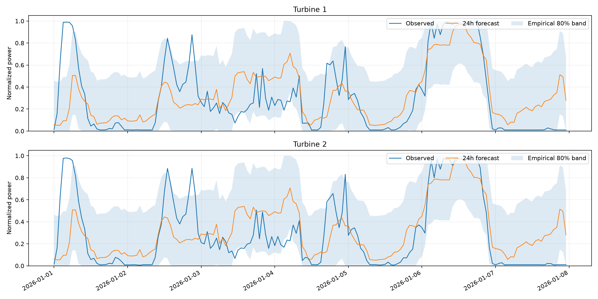
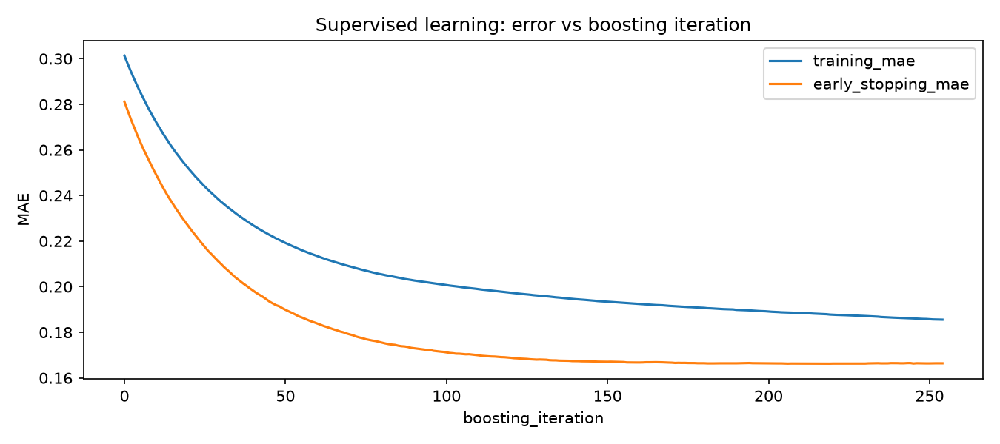

# Сравнение моделей с обучением с учителем

Входы: архивные прогнозы погоды и, при наличии, завершённые прошлые измерения. Ответ: фактическая почасовая мощность.

Часовой пояс: `Asia/Almaty`; подтверждён пользователем: True.

Параметры выбираются по четырём временным блокам (при стандартных настройках), ранняя остановка — по отдельному прошлому блоку внутри обучения.

| Вариант | Средняя MAE на временной валидации |
|---|---:|
| Прежние параметры | 0.22858 |
| Подбор, только погода | 0.20995 |
| Подбор, погода + история с резервным режимом | 0.21106 |
| Выбранная комбинация | 0.20966 |

Выбран режим `weather_and_history_blend_with_fallback`. Изменение MAE относительно прежних параметров: 8.28% улучшения.

Вес модели с историей: 25%. Проверены веса 0/25/50/75/100% только по временной валидации.

## Проверка на ранее просмотренном январе

Этот период уже использовался в первом отчёте. Он не является новым слепым тестом; параметры текущего поиска выбирались без январских целей.

| Вариант | MAE | RMSE | R² |
|---|---:|---:|---:|
| v1 | 0.24883 | 0.30958 | 0.1584 |
| weather | 0.23757 | 0.31400 | 0.1343 |
| history_with_fallback | 0.23095 | 0.30380 | 0.1896 |
| selected | 0.23504 | 0.31010 | 0.1556 |

В феврале новых измерений SCADA нет: при устаревании истории используется погодная модель. Будущая фактическая мощность в признаки не попадает.

Для независимой оценки улучшения нужны ещё не использованные фактические измерения, например за февраль.

## Как модель учится

На каждой итерации новые деревья корректируют ошибки относительно известных ответов. График показывает ошибку на обучающих примерах и отдельном блоке ранней остановки.

