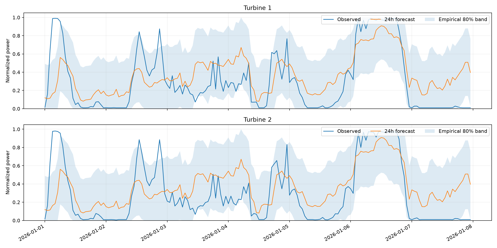

# Отчёт о модели ВЭС

Проверка: январь 2026, исключённый из обучения и подбора параметров.

Часовой пояс CSV: `Asia/Almaty` (допущение). Источник: архивные прогнозы GFS.

MAE: **0.2488**, RMSE: **0.3096**, R²: **0.1584**.

MAE измеряется в долях нормализованной мощности, а не в процентах от фактической выработки.

| Модель | MAE | RMSE |
|---|---:|---:|
| XGBoost | 0.2488 | 0.3096 |
| baseline_mean | 0.2995 | 0.3407 |
| baseline_seasonal | 0.2899 | 0.3378 |
| baseline_persistence | 0.3448 | 0.4527 |

| Турбина | Горизонт | MAE | RMSE |
|---|---|---:|---:|
| 1 | 1–24 ч | 0.2325 | 0.2936 |
| 1 | 25–48 ч | 0.2588 | 0.3182 |
| 2 | 1–24 ч | 0.2394 | 0.3006 |
| 2 | 25–48 ч | 0.2645 | 0.3249 |

Покрытие эмпирического 80% интервала на январе: 78.4%.

Финальная модель переобучена на всех доступных целях до 1 февраля; приведённые метрики относятся к отдельной проверочной модели.

В феврале фактическая мощность не предоставлена: качество февральского прогноза пока неизвестно.

Все параметры, разбиения и ограничения: [metrics.json](metrics.json).
